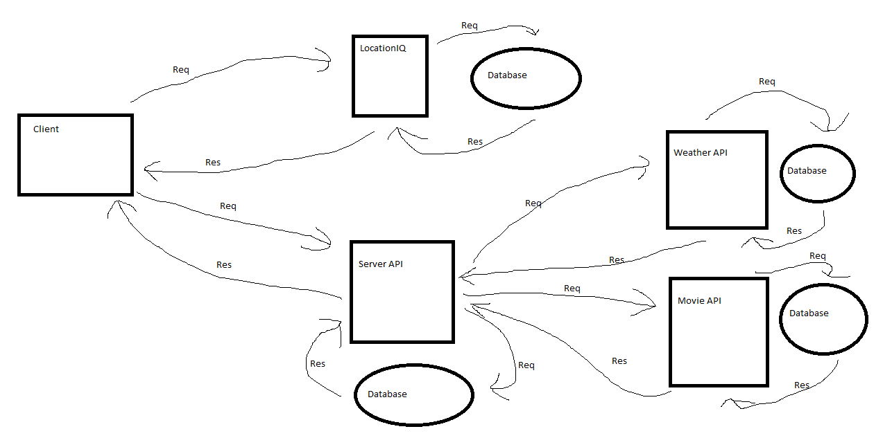

**Author** Kirk Garrison
**Version**: 0.1.0

## Overview
Request/Reponse cycle

API Request/Response cycle

API Request/Response cycle with Weather and Movie API's

<!-- Provide a high level overview of what this application is and why you are building it, beyond the fact that it's an assignment for this class. (i.e. What's your problem domain?) -->

## Getting Started
<!-- What are the steps that a user must take in order to build this app on their own machine and get it running? -->
Something

## Architecture
<!-- Provide a detailed description of the application design. What technologies (languages, libraries, etc) you're using, and any other relevant design information. -->

## Change Log

<!-- Use this area to document the iterative changes made to your application as each feature is successfully implemented. Use time stamps. Here's an example:

01-01-2001 4:59pm - Application now has a fully-functional express server, with a GET route for the location resource. -->

## Credit and Collaborations
- Steve Ngo - collaborator for Request/Response cycle
- Scott - collaborator for API Request/Response cycle
- Raajvardhan Chaukulkar - collaborator for Weather and movie API additions
- Brandon Wolf - collaborator for refactoring code into nested components.

- LocationIQ for use to city info
- WeatherBit for use of Forecast data
- TMDB for use of Movie data

### Name of feature: City-Explorer Lab 6

Estimate of time needed to complete: 3 Hours

Start time: 2:30pm

Finish time: 6:00pm

Actual time needed to complete: 3.5 Hours

### Name of feature: City-Explorer Lab 7

Estimate of time needed to complete: 4 Hours

Start time: 1:30pm

Finish time: 7:00pm

Actual time needed to complete: 5.5 Hours

### Name of feature: City-Explorer Lab 8

Estimate of time needed to complete: 5 Hours

Start time: 1:00pm

Finish time: 8:00pm

Actual time needed to complete: 7 Hours

### Name of feature: City-Explorer Lab 9

Estimate of time needed to complete: 2 Hours

Start time: 1:30pm

Finish time: 3:00pm

Actual time needed to complete: 1.5 Hours

### Name of feature: City-Explorer Lab 10

Estimate of time needed to complete: 3 Hours

Start time: 2:30pm

Finish time: 6:00pm

Actual time needed to complete: 3.5 Hours